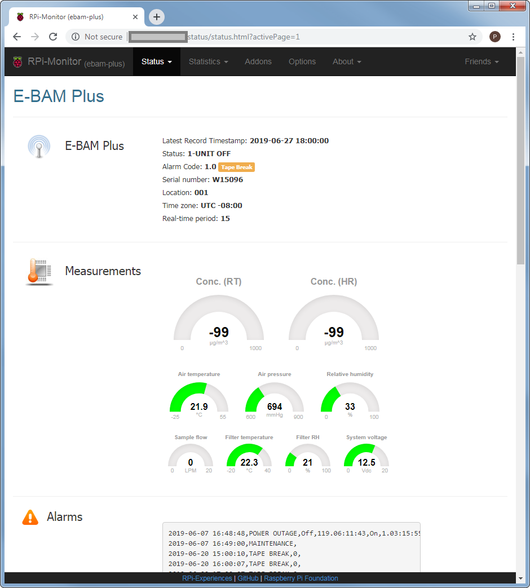
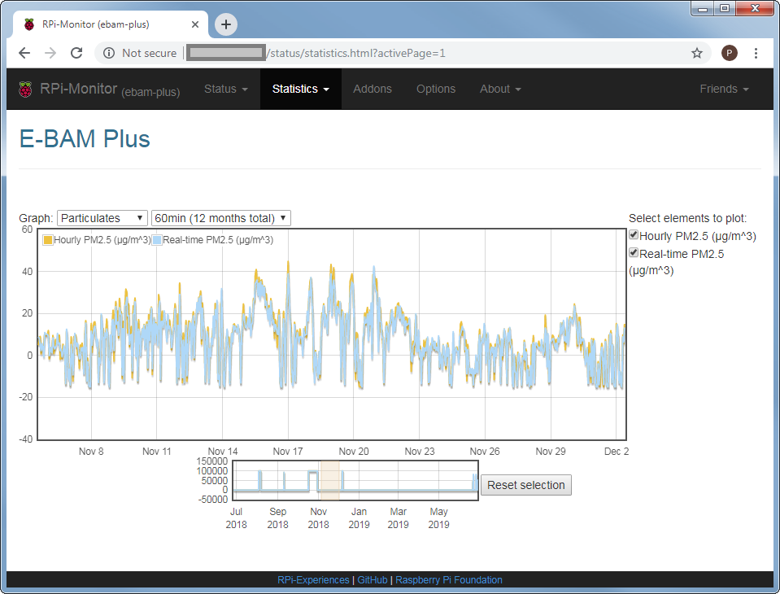
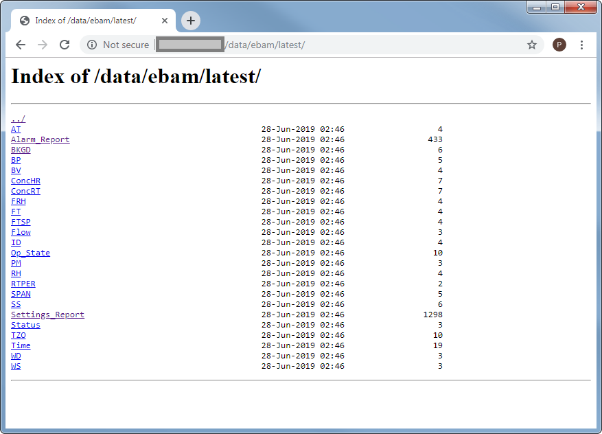
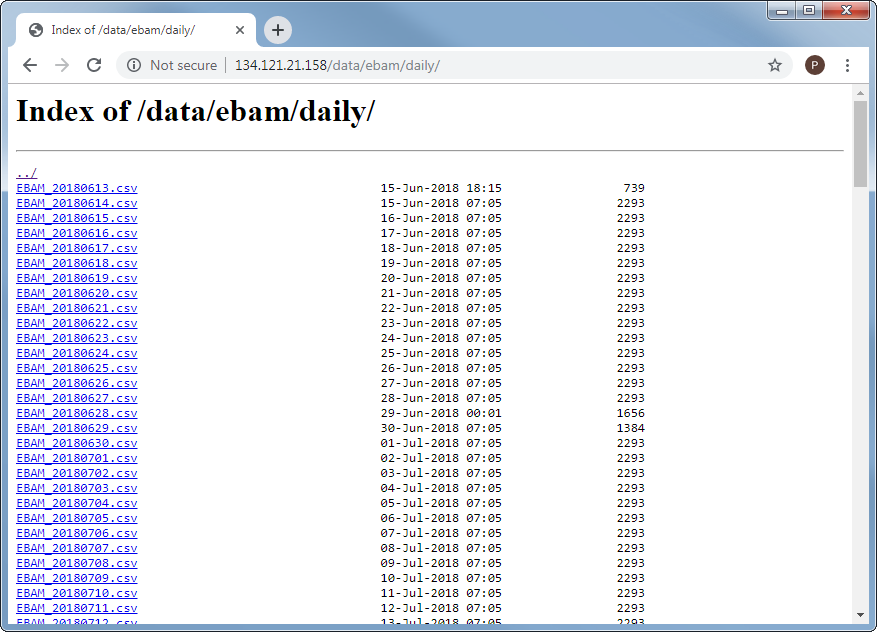

# E-BAM PLUS Raspberry Pi Interface

Turn a Raspberry Pi into serial data logger &amp; remote access client for
MetOne Instruments [E-BAM PLUS](https://metone.com/products/e-bam-plus/).
This was developed for the unit deployed at our
[Urbanova Air Quality Refererence Site](https://github.com/wsular/urbanova-aqnet-ref-site).

* [Software setup](setup.md)
* [Hardware build](build/)

### Screenshots

View the current status of your E-BAM PLUS:

Plot historical data:

Browse & download individual data values:

Browse & download historical data files:

### License

Certain files within `src/var/www/html/resources/` are available under the
Creative Commons Attribution 4.0 International License. 

This work licensed under [The MIT License](http://opensource.org/licenses/mit-license.html).
