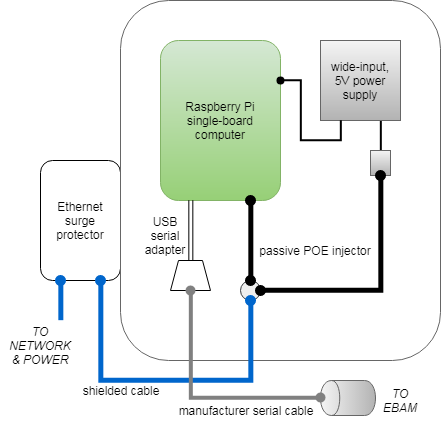
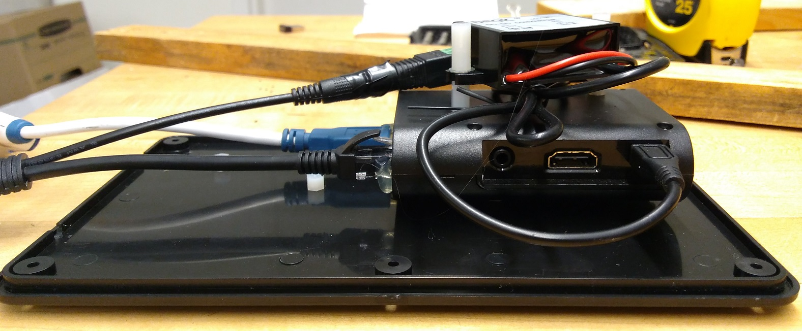
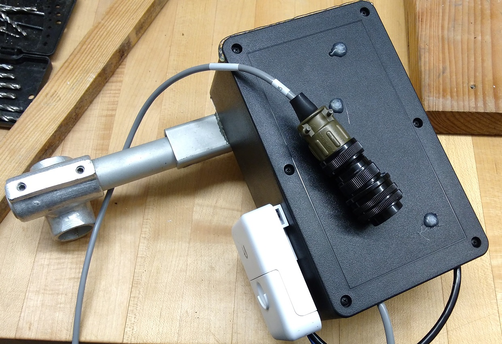

# Hardware Setup

## E-BAM PLUS Raspberry Pi Interface

Here's what we did. 

### Bill of Materials

* Raspberry Pi (we used a Model 2 B+), plus:
    * Class 10 micro SD card
    * inexpensive plastic clamshell case
* instrument serial cable (Met One Instruments p/n 9321)
* *power delivery stuffs*
    * wide-input (9-30V), 5V power supply with micro USB output
    * passive POE injector kit
    * 12V/1A power supply
    * 75ft CAT6 cable
* *enclosure stuffs*
    * ABS enclosure, ~5"x8"x3"
    * salvaged 3/4" pipe mount
    * Ethernet surge protector
    * shielded 1ft CAT6 cable
    * assorted nylon M3 standoffs
    * assorted 4-40 hardware
    * hot glue

### Enclosure Construction

The computer and power supply are stacked onto the enclosure lid using nylon
standoffs. Dabs of hot glue secure connectors in place.

The enclosure box is mounted on a salvaged 3/4" pipe mount (that's 1" O.D.).
An Ethernet surge protector bolted to the side is used as a "bulkhead" fitting.

Tuck everything inside...

After closing it up, use hot glue to seal upward-facing seams. Although not
fully waterproof, the internal lip of the enclosure lid will do a reasonable
job of preventing water ingress. A hot glue seam will further deter snow or 
standing water from seeping in.

